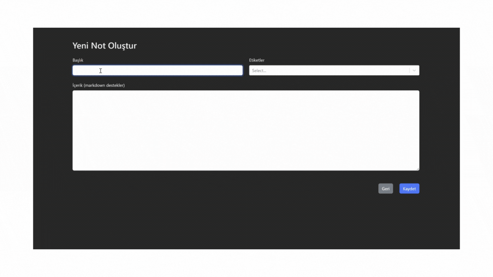

# Kütüphaneler

- react-router-dom
- react-bootstrap
- bootstrap
- react-markdown
- react-select
- uuid

# Özellikler

- Not Oluşturma: Kullanıcılar, başlık, içerik (markdown destekli) ve birden fazla etiketle yeni notlar oluşturabilir.
- Not Düzenleme: Mevcut notlar başlık, içerik veya etiketlerini güncellemek için düzenlenebilir.
- Not Silme: Notlar silinebilir ve bu işlem yerel depolamadan kaldırılmalarına neden olur.
- Not Detaylarını Görüntüleme: Kullanıcılar, belirli bir notun detaylarını markdown formatında görüntüleyebilir.
- Etiket Oluşturma: Not eklerken veya düzenlerken yeni etiketler dinamik olarak oluşturulabilir.
- Etikete Göre Filtreleme: Kullanıcılar, seçtikleri etiketlere göre notları filtreleyerek ilgili notlara hızlıca ulaşabilir.
- Başlığa Göre Arama: Kullanıcılar, arama çubuğuna bir sorgu yazarak notları başlığa göre arayabilir. Arama büyük/küçük harf duyarsızdır.
- Etikete Göre Filtreleme: Notlar, bir veya daha fazla etikete göre filtrelenebilir ve yalnızca ilgili sonuçlar gösterilir.

# GIF

